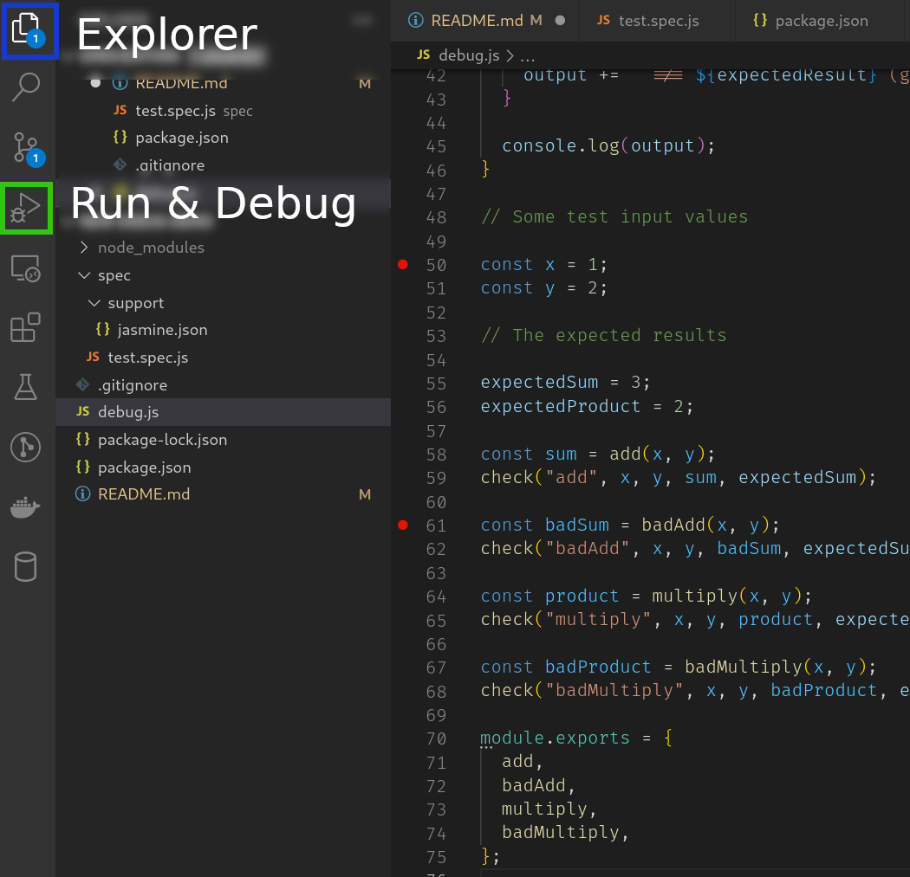
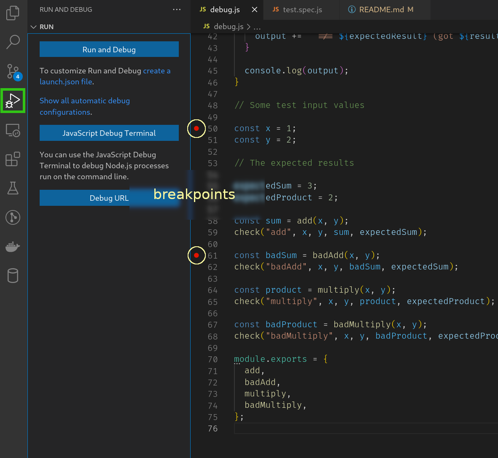
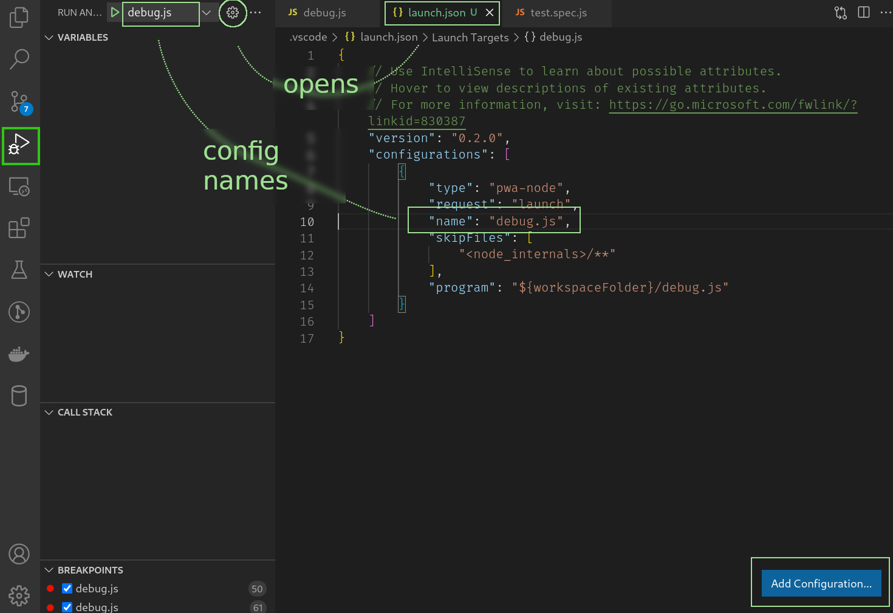
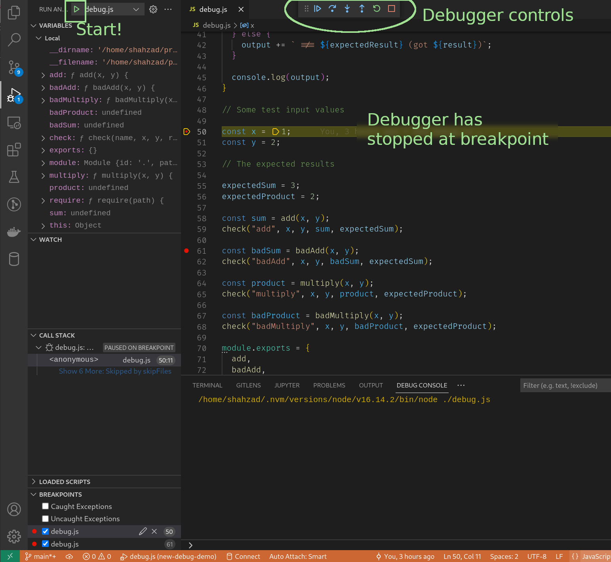

# Debug Demo

## DO NOT RUN THE FOLLOWING - For Reference Only

**The following steps were followed to create this repository. You do not need to do this as all of the files mentioned below now exist.**

- Add this README.md file
- Add debug.js file to demo debugging a single JS file
- Add Jasmine
  - npm add jasmine --save-dev
  - npx jasmine init
- Add .gitignore to exclude `node_modules`
- Add "test": "jasmine" script to package.json
- Create a simple Jasmine test spec
  - spec/test.spec.js

## Links

[VSCode Node.js Debugging Page](https://code.visualstudio.com/docs/nodejs/nodejs-debugging)

## Start Here

- Run the following command in a Terminal to install the required NPM modules
  - `npm install`

## VSCode Intro

The following image shows a VSCode window with the `Explorer` and `Run and Debug` buttons in the `Activity Bar`.
It shows part of the active `debug.js` tab in the `Editor`



## Debugging 'debug.js'

- Open the `debug.js` file in the `Explorer`
- Switch to `Run and Debug`

You should see something similar to the following image. Please note the red circles to the left of lines 50 and 61 in the `Editor`. These are `breakpoints` and program executions will stop at these when `debug.js` is run using the `Debugger`. If you do not see the `breakpoints` you can add/remove them by hovering you mouse to the left of a line number and click.



- Click on the `create a launch.json file`
- Select `Node.js` as the `debugger`

This will create a file called `launch.json` that contains the information to debug files in your project.

- Modify the value of the `"name"` property of the configuration you have just added to `"debug.js"` and save your changes
  - It should look like this

    ```json
    ...
    "name": "debug.js"
    ...
    ```
- We have now completed the setup required to start debugging. The `launch.json` should look something like the image below.



- Now go back to the `debug.js` tab and click the small green play icon to the left of the configuration name of `debug.js`

Once you have started the debugger, it will run until it reaches the first `breakpoint` - which is on line 50. You should see something like the image below.



Note that when the debugger is running, the VSCode status bar background colour changes to orange.

We can now start using the debugger to examine the execution of our program, step by step.

## Debugging Jasmine tests
