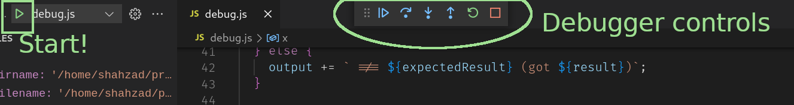

# Debug Demo

### DO NOT RUN THE FOLLOWING - For Reference Only

**The following steps were followed to create this repository. You do not need to do this as all of the files mentioned below now exist.**

- Add this README.md file
- Add debug.js file to demo debugging a single JS file
- Add Jasmine
  - npm add jasmine --save-dev
  - npx jasmine init
- Add .gitignore to exclude `node_modules`
- Add "test": "jasmine" script to package.json
- Create a simple Jasmine test spec
  - spec/test.spec.js

## Links

[VSCode Node.js Debugging Page](https://code.visualstudio.com/docs/nodejs/nodejs-debugging)

## Start Here

- Run the following command in a Terminal to install the required NPM modules
  - `npm install`

## VSCode Intro

The following image shows a VSCode window with the `Explorer` and `Run and Debug` buttons in the `Activity Bar`.
It also shows part of the active `debug.js` tab in the `Editor` on the right


## Debugging 'debug.js'

- Open the `debug.js` file in the `Explorer`
- Switch to `Run and Debug`

You should see something similar to the following image. Please note the red circles to the left of lines 50 and 61 in the `Editor`. These are `breakpoints` and program execution will stop at these when `debug.js` is run using the `Debugger`

You can add the missing `breakpoints` add them by hovering your mouse to the left of a line number (50 and 61 in our case) and clicking when you see a dark red circle appear. Clicking again will remove a breakpoint

Please ensure that lines 50 and 61 have a `breakpoint`.


- Click on the `create a launch.json file`
- Select `Node.js` as the `debugger`
- Now select the entry `{} Node.js: Launch Program` from the displayed list

This will create a file called `launch.json` that contains the information to debug files in your project

- Modify the value of the `"name"` property of the configuration you have just added to `"debug.js"` and save your changes
  - It should look like this

    ```json
    ...
    "name": "debug.js"
    ...
    ```
- We have now completed the setup required to start debugging. The `launch.json` should look something like the image below


- Now go back to the `debug.js` tab and click the small green play icon to the left of the configuration name of `debug.js`

Once you have started the debugger, it will run until it reaches the first `breakpoint` - which is on line 50. You should see something like the image below


Note that when the debugger is running, the VSCode status bar background colour changes to orange

We can now start using the debugger to examine the execution of our program, step by step

We do this using the `Debugger Controls` shown above - top middle - and also shown below



The `controls` are (left to right, starting with the blue play/pause icon)

- Continue - continue running the program until the next `breakpoint` or the end
- Step Over - step over the current line (does not enter any function(s) called in the line)
- Step Into - steps into the first function call on the current line
- Step Out - when you have stepped into a function, you can step out to where it was called from
- Restart - restart the program
- Stop - stop the program and the debugger

Using the `controls` and the information to the left of the `Editor` you can get an exact understanding of what a program is doing at any point

## Debugging Jasmine tests

To debug `Jasmine` tests that are run using the `npm test` command, a new `Configuration` is required

- Switch to `Run and Debug` to add a new `Configuration`
- Now click on the `Cog` icon to open the `launch.json` file
- You can now click the blue `Add Configuration...` button
- This time, choose `{} Node.js: Launch via npm`
- Now, we edit the newly added `Configuration` to run our `Jasmine` tests using `npm test`
  - Update `"name"` and `"runtimeArgs"` propeties so that they are as shown below - you will need to add the `"console": ...` line

    ```json
    "name": "Jasmine tests",
    
    "runtimeArgs": [
        "test"
    ],
    "console": "integratedTerminal"
    ```

Now that we have a `Configuration` to run `Jasmine` tests, we can add a breakpoint to the `spec/test.spec.js` file so that we can debug a test! Add a breakpoint at line 30 - this has many function calls on a single line

To debug the tests, switch to `Run and Debug` and then select `Jasmine tests` from the dropdown list and click the small green play icon to the left

The debugger should stop at the breakpoint at line 50 and now we can use the `Step In` and `Step Out` controls so see how each function is being called on the line and in what order. You should see execution switching between files as the `add` and `multiply` functions are being called
